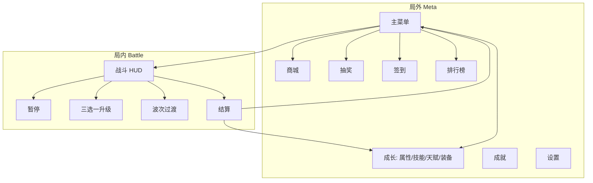

# UI Wireframe & Figma 页面规格（Attack Barbarians）

> 竖屏无限防守 + Roguelike · 参考分辨率 **1080×1920**  
> **视觉风格：** 默认科技废土 → `prompt_ui_tech_wasteland_visual_design.md`；备选仙侠 → `prompt_ui_xianxia_visual_design.md`（Canvas Scaler Reference Resolution 与 `UI和游戏流程.md` 一致，实现时可改为 1920×1080 横版参考再旋转，本项目以 **竖屏 1080 宽** 为准）。

---

## 信息架构（IA）

---

## Figma 文件结构

| Page | 含 Frame |
|------|----------|
| `00_DesignSystem` | Colors, Typography, Components |
| `01_MainMenu` | MainMenu, ModeSelect, StaminaEmpty |
| `02_Battle_HUD` | HUD_Playing, HUD_Boss, HUD_Elite |
| `03_Roguelike_Flow` | UpgradePanel, WaveTransition, Pause, GameOver |
| `04_Meta_Growth` | Attr, Skill, Talent, Equipment |
| `05_Shop` | ShopHome, PurchaseConfirm, Insufficient |
| `06_Gacha` | GachaMain, GachaResult x1/x10, Probability |
| `07_SignIn` | SignIn7Day, Claimed, Makeup |
| `08_Leaderboard` | WaveRank, TimeRank, PowerRank |
| `09_Achievement` | List, Detail |
| `10_Settings` | Settings, Dialog |
| `99_Export_Slices` | 全部 Icon + 九宫格面板 |

机器可读树：`docs/figma/figma_project_structure.json`

---

## 页面线框规格

### P01 主菜单 `MainMenu`

| 区域 | 位置 (px) | 尺寸 | 内容 |
|------|-----------|------|------|
| 顶栏资源 | y:48, full width | h:72 | 金币、钻石、体力条 |
| 玩家信息 | x:48, y:130 | 320×96 | 头像、昵称、战力 |
| 模式选择 | center y:520 | 880×200×2 | 普通 / 精英卡片 |
| 主 CTA | center y:920 | 520×120 | 「开始修行」 |
| 浮动入口 | 左右边 y:400 | 96×96 | 签到、抽奖 |
| 底栏导航 | y:1760 | full×120 | 首页/战斗/商城/排行/更多 |

**交互：** 体力不足 → `StaminaEmpty` 弹窗；开始 → `Loading` → `HUD_Playing`。

---

### P02 战斗 HUD `GameplayHUD`

| 区域 | 位置 | 内容 |
|------|------|------|
| 顶左 | x:32,y:48 | 波次文本、局内等级 |
| 顶中 | center | 计时 MM:SS |
| 顶右 | x:980,y:48 | 暂停 88×88 |
| 生命条 | y:120, w:1016,h:36 | HP 数值 + 条 |
| 经验条 | y:164, w:1016,h:24 | EXP + Lv |
| 中央 | — | **留空** 给塔防/射击玩法 |
| Buff 行 | y:1520, h:64 | 最多 8 个 64×64 |
| 技能栏 | y:1600, h:120 | 5 槽 96×96 + CD 遮罩 |
| 底左 | x:32,y:1720 | 本局金币 |
| 底右 | x:900,y:1720 | 击杀数 |

**事件绑定：** `Player.HealthChanged`, `Wave.Started`, `Player.LevelUp`, Buff 列表变更。

---

### P03 局内三选一 `UpgradePanel` · `ui.upgrade`

| 元素 | 规格 |
|------|------|
| 遮罩 | 全屏 #000 55% |
| 标题 | 「天道择一」居中 y:200 |
| 卡片×3 | 各 300×520，间距 40，y:400 |
| 卡片内容 | 稀有度框、图标 128、名称、描述、标签 |
| 确认 | 底部 y:1680，宽 400，选后高亮 |

**逻辑：** `Time.timeScale=0`；选后 `UpgradeManager.Select` → 恢复 Playing。

---

### P04 波次过渡 `WaveTransition` · `ui.wave_transition`

| 元素 | 规格 |
|------|------|
| Banner | y:280, 全宽 h:160 |
| 敌人预览 | 3×80 图标 |
| 倒计时 | 中心 120px 数字 |
| 继续 | y:1500 |

---

### P05 暂停 `Pause` · `ui.pause`

竖排按钮区 中心 480×600：继续 / 重开 / 返回山门；半透明遮罩。

---

### P06 结算 `GameOver` · `ui.game_over`

卷轴面板 920×1200 @ y:360：

| 行 | 数据字段 |
|----|----------|
| 本局时长 | `runDurationSeconds` |
| 最高波次 | `maxWave` |
| 击杀 | `killCount` |
| 奖励 | 金币、属性卡、技能卡 |

按钮：再次挑战、返回山门、（可选）看广告双倍。

---

### P07 角色成长 `MetaGrowth`

**Tab：** 属性 | 技能 | 天赋 | 装备（顶栏 y:200）

#### 属性页
- 2×2 大卡片：HP / 攻击 / 移速 / 攻速
- 每卡：当前等级、下一级加成预览、升级按钮
- 消耗：`AttrUpgradeCardCost` 显示属性卡数量

#### 技能页
- 列表项高 140：图标、名称、等级、锁定遮罩（`total_play_seconds`）
- 升级消耗：专卡 + 通用卡

#### 天赋页
- 纵向节点树，前置线连接，可升级节点玉色发光

#### 装备页
- 中央人形槽位：武器/头/胸/脚/饰
- 右侧列表：背包格（后期）
- 强化按钮、套装 2 件提示

**事件：** `Talent.Changed`, `Equipment.Changed`

---

### P08 商城 `Shop`

| 区块 | 说明 |
|------|------|
| 免费钻 Banner | 12h 冷却 `lastFreeDiamondClaim` |
| Tab | 推荐/资源/礼包/免费 |
| 商品格 | 2 列，图+名+价+限购 |
| 购买弹窗 | 确认 / 不足提示 |

**数据：** `ShopItemSO`, `ResourceManager`

---

### P09 抽奖 `Gacha`

| 区块 | 说明 |
|------|------|
| 单抽/十连 | 钻石 + 券双货币 |
| 保底条 | `gachaPityCounter` |
| 概率公示 | 独立 Frame `Probability`，列表权重 |
| 结果 | 1/10 物品展示 |

**合规：** 展示与 `GachaTable` 一致（PRD AC-13）。

---

### P10 签到 `SignIn`

7 格横向：1–6 属性卡图标，7 技能卡大格；今日高亮；已签盖章。

**数据：** `signInDayInCycle`, `SignInRewards`

---

### P11 排行榜 `Leaderboard`

| Tab | 排序字段 |
|-----|----------|
| 波次 | `maxWaveReached` |
| 时长 | `bestRunSeconds` |
| 战力 | `combatPower` |

Top3 展台 + 列表；自己行底栏固定。

> 一期可为本地榜 / 占位；UI 预留「赛季结束」文案区。

---

### P12 成就 `Achievement`

分类 Chip + 行列表：进度条、奖励、领取；红点 `AchievementManager`。

---

### P13 设置 `Settings`

音量、震动、语言、用户协议、清除缓存、版本号。

---

## 组件库（Figma Components）

| 组件名 | 变体 |
|--------|------|
| `Btn/Primary` | Default, Pressed, Disabled |
| `Btn/Secondary` | Default, Disabled |
| `Btn/Icon` | 88, 96, 120 |
| `Panel/Scroll` | SM, MD, LG |
| `Panel/Modal` | WithTitle, Confirm |
| `Bar/HP` | Full, Low(<30%) |
| `Bar/EXP` | — |
| `Bar/Stamina` | Full, Empty |
| `Card/BuffChoice` | Common, Rare, Epic, Legendary |
| `Card/ShopItem` | Gold, Diamond, SoldOut |
| `Chip/Currency` | Gold, Diamond, Ticket, Energy |
| `Tab/BottomNav` | 5 items, Selected |
| `Badge/RedDot` | — |
| `IconFrame` | Circle, Square, Slot |

---

## Unity 对接备注

- Canvas：`Scale With Screen Size`，Reference Resolution **1080×1920**，Match **0.5**
- 面板切换：订阅 `UI.PanelOpened` / `Closed`，Id 见 `GameConstants.UiPanelIds`
- 需扩展 Id：`ui.shop`, `ui.gacha`, `ui.sign_in`, `ui.leaderboard`, `ui.growth`, `ui.achievement`, `ui.settings`
- 资源路径建议：`Assets/UI/Prefabs/Panels/`, `Assets/UI/Sprites/Icons/`
