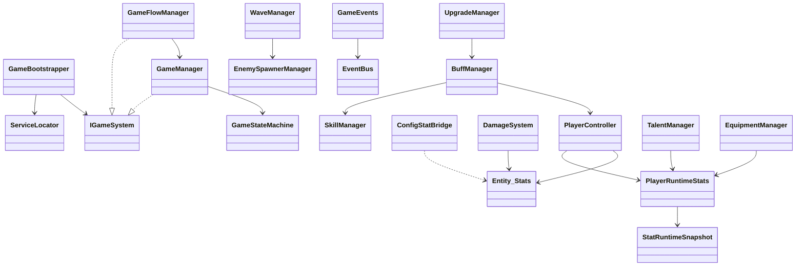

# Attack Barbarians v2 系统架构设计

> 版本：v2 | 引擎：Unity 6000.3 LTS | 类型：2D 竖屏无限防守 + Roguelike

---

## 1. 项目定位与核心循环

### 1.1 玩法摘要
- **竖屏防守**：Player 位于屏幕下侧，Enemy 从上方生成并直线接近后攻击。
- **无限波次**：每波随机敌种；清场或 30s 超时后进入下一波。
- **Roguelike 成长**：击杀获经验 → 升级 → 三选一 Buff；每 4 次选择中前 3 次为四维属性 Buff，第 4 次为技能效果 Buff。
- **局内临时 / 局外永久**：局内 Buff 仅本局有效；天赋、装备、技能解锁为永久成长。

### 1.2 核心循环
```
MainMenu → Loading → Playing
  ↓ 击杀 Enemy
  ↓ 经验达标 → UpgradeChoosing（三选一）
  ↓ 波次结束 → WaveTransition → UpgradeChoosing
  ↓ Player 死亡 → GameOver → 结算奖励 → MainMenu
```

---

## 2. 分层架构（Layered Architecture）

```
┌─────────────────────────────────────────────────────────────┐
│  L5  Meta / LiveOps   Shop · SignIn · Gacha · Stamina · Rank│
├─────────────────────────────────────────────────────────────┤
│  L4  Presentation       UI · Audio · VFX · DamageNumber     │
├─────────────────────────────────────────────────────────────┤
│  L3  Progression        Upgrade · Talent · Equipment · Save │
├─────────────────────────────────────────────────────────────┤
│  L2  Gameplay Content   Wave · Boss · SpecialEnemy · Map    │
├─────────────────────────────────────────────────────────────┤
│  L1  Combat Core        Player · Enemy · Damage · Projectile │
│                         · Collision · AutoAttack · Skill    │
├─────────────────────────────────────────────────────────────┤
│  L0  Foundation         Bootstrap · GameState · EventBus    │
│                         · ServiceLocator · Pool · Config      │
└─────────────────────────────────────────────────────────────┘
```

**依赖规则（单向，禁止反向引用）：**
- L(n) 只能依赖 L(0..n-1) 的 **接口 / 事件 / 配置**。
- 跨层通信优先 **GameEvents**；禁止 L0 引用 L3+ 具体类。
- 场景实体（Player/Enemy）通过 **Controller + Bridge** 接入系统层，不直接持有 Manager 引用。

---

## 3. 核心模块职责划分

| 模块 | 层级 | 职责 | 关键类 |
|------|------|------|--------|
| **Bootstrap** | L0 | 启动顺序、ServiceLocator 注册、IGameSystem 生命周期 | `GameBootstrapper`, `ServiceLocator` |
| **GameState** | L0 | 状态机、timeScale、流程 API | `GameManager`, `GameStateMachine`, `GameFlowManager` |
| **Event** | L0 | 跨模块解耦消息 | `EventBus`, `GameEvents`, `GameEventArgs` |
| **Config** | L0 | SO 数据库、ID 索引、校验 | `ConfigManager`, `ConfigDatabaseSO`, `*DataSO` |
| **Pool** | L0 | 高频对象复用 | `PoolManager`, `ObjectPool` |
| **Save** | L0/L3 | 持久化、版本迁移 | `SaveManager`, `SaveVersionMigrator` |
| **Player** | L1 | 实体状态机、运行时属性、目标策略 | `Player`, `PlayerController`, `PlayerRuntimeStats` |
| **Enemy** | L1 | 生成、AI 状态机、战斗桥接 | `EnemySpawnerManager`, `Enemy`, `EnemyCombatBridge` |
| **Damage** | L1 | 统一伤害结算 | `DamageSystem`, `DamagePipeline`, `DamageInfo` |
| **Projectile** | L1 | 子弹生成与池化 | `ProjectileManager`, `ProjectileController` |
| **Collision** | L1 | 空间查询 NonAlloc | `CollisionManager`, `CollisionQuery` |
| **AutoAttack** | L1 | 自动普攻节拍（与射击技能协调） | `AutoAttackController` |
| **Skill** | L1 | 技能运行时、冷却、效果 | `SkillManager`, `ISkillEffect`, `SkillContext` |
| **Buff** | L1/L3 | 属性 Buff + 技能 Buff 路由 | `BuffManager`, `SkillBuffProfile` |
| **Wave** | L2 | 波次推进、超时/清场判定 | `WaveManager`, `WaveDataSO` |
| **Boss** | L2 | 阶段、特殊技能 | `BossController`, `BossPhaseController` |
| **SpecialEnemy** | L2 | 精英能力（护盾/冲锋/分裂等） | `SpecialEnemyController`, `IEnemyAbility` |
| **Upgrade** | L3 | 局内三选一 | `UpgradeManager`, `RandomRewardManager` |
| **Talent/Equipment** | L3 | 局外永久修正 | `TalentManager`, `EquipmentManager` |
| **Map/Events** | L2 | 地图与局内事件 | `MapManager`, `GameplayEventManager` |
| **UI** | L4 | HUD、面板、Presenter | `*Presenter`, `GameEventSubscriberBase` |
| **Economy** | L5 | 商店、签到、抽奖（待实现） | 预留 Event Key |

---

## 4. 模块依赖与调用关系

### 4.1 启动链（Bootstrap 顺序）
```
ConfigManager
  → SaveManager
  → TalentManager / EquipmentManager
  → EventBus
  → PoolManager
  → GameManager / GameFlowManager
  → RunSessionTracker / RunRewardSettlementService
  → PlayerExperienceService
  → UpgradeManager / RandomRewardManager
  → DamageSystem / CollisionManager / ProjectileManager
  → SkillUnlockService / ContentRegistry
  → MapManager / GameplayEventManager
  → EnemySpawnerManager / WaveManager
  → BossRunStatsBridge
```

### 4.2 战斗数据流
```
ConfigManager ──SO──► PlayerController.InitializeFromConfig
                         │
                         ▼
              PlayerRuntimeStats.RebuildSnapshot
                         │
                         ▼
              ConfigStatBridge ──► Entity_Stats（战斗读数）
                         │
WaveManager ──► EnemySpawnerManager ──► Enemy
                         │
AutoAttackController / SkillManager ──► ProjectileManager
                         │
                         ▼
              CollisionQuery / OnTrigger
                         │
                         ▼
              DamagePipeline ──► DamageSystem.ApplyDamage
                         │
                         ▼
              GameEvents.RaiseEnemyKilled / DamageApplied
                         │
                         ▼
              PlayerExperienceService / UI Presenters
```

### 4.3 成长数据流
```
UpgradeManager.RollOptions
  → BuffManager.ApplyBuff（属性 or 技能）
    → PlayerRuntimeStats / SkillManager
  → GameEvents.RaiseBuffChanged

TalentManager / EquipmentManager
  → RebuildCombinedModifiers
  → PlayerRuntimeStats.SetTalent/EquipmentModifiers
  → PlayerController.RefreshEntityStats
```

### 4.4 事件流（关键 Event Key）
| 事件 | 发布方 | 主要订阅方 |
|------|--------|-----------|
| `GameStateChanged` | GameManager | GameFlowManager, UI, SaveManager |
| `WaveCompleted` | WaveManager | GameFlowManager |
| `UpgradeSelectionOpened` | GameFlowManager | RandomRewardManager, UI |
| `EnemyKilled` | Enemy | PlayerExperienceService, WaveManager |
| `DamageApplied` | DamageSystem | UI DamageNumber |
| `BuffChanged` | PlayerController | UI |
| `GameOver` | GameManager | SaveManager, RunRewardSettlement |

---

## 5. 类图关系（核心）



---

## 6. 目标文件结构（v2）

```
Assets/Scripts/
├── Core/                    # L0：Bootstrap, GameState, Singleton, ServiceLocator
├── Events/                  # L0：GameEvents, EventArgs
├── Config/                  # L0：SO 定义 + Runtime 快照 + Validator
├── Pool/                    # L0
├── Save/                    # L0/L3
├── Content/                 # L0：资产加载注册
├── Player/                  # L1
├── Enemy/                   # L1
├── Damage/                  # L1
├── Projectile/              # L1
├── Collision/             # L1
├── AutoAttack/              # L1
├── SkillSystem/             # L1：Core, Buff, Skills, SkillObject, Data
├── Wave/                    # L2
├── Boss/                    # L2
├── SpecialEnemy/            # L2
├── Elite/                   # L2
├── Map/                     # L2
├── Upgrade/                 # L3
├── Talent/                  # L3
├── Equipment/               # L3
├── Managers/                # 跨层编排（Flow, Wave, Config, Run）
├── UI/                      # L4
├── Wall/                    # L1 代理（敌人→Player 伤害转发，逐步弱化）
├── Common/                  # 遗留 Entity 基类（迁移中，不新增依赖）
└── Utils/                   # 工具（PlayerSceneAccess 等）
```

### 6.1 程序集划分（目标 asmdef，分阶段引入）
| 程序集 | 文件夹 | 可引用 |
|--------|--------|--------|
| `AB.Core` | Core, Events, Pool, Utils | UnityEngine |
| `AB.Config` | Config, Data | AB.Core |
| `AB.Combat` | Player, Enemy, Damage, Projectile, Collision, AutoAttack | AB.Core, AB.Config |
| `AB.Skills` | SkillSystem | AB.Combat |
| `AB.Gameplay` | Wave, Boss, SpecialEnemy, Map, Upgrade | AB.Skills |
| `AB.Meta` | Talent, Equipment, Save | AB.Gameplay |
| `AB.UI` | UI | AB.Meta |
| `AB.Editor` | Editor/* | All |

> **当前状态**：默认仍在 `Assembly-CSharp`；程序集定义与分阶段工具已落地（`Assets/Scripts/_Assemblies/`、`AssemblyMigrationCatalog`、菜单 `Attack Barbarians/Assembly/*`）。在 Unity 中按 `docs/version_02/asmdef_migration.md` 从 Phase 1 逐步 Apply。

---

## 7. ScriptableObject 配置设计

| 资产类型 | 路径规范 | 用途 |
|----------|----------|------|
| `GameConfig` | `Resources/Config/GameConfig.asset` | 全局开关、波次参数 |
| `ConfigDatabaseSO` | `Resources/Config/ConfigDatabase.asset` | 全表索引入口 |
| `PlayerDataSO` | Config/Data | 玩家基础四维 |
| `EnemyDataSO` | Config/Data | 敌人模板 |
| `WaveDataSO` | Config/Data | 波次权重与上限 |
| `SkillDataSO` | Config/Data | 技能基础参数 |
| `BuffDataSO` | Config/Data | Buff 类型、modifier、SkillBuffKind |
| `UpgradeOptionSO` | Upgrade/Data | 三选一选项 |
| `TalentDataSO` | Talent/Data | 天赋树 |
| `EquipmentDataSO` | Equipment/Data | 装备与套装 |
| `DamageCalculationSO` | Config/Data | 伤害公式 |

**命名**：`{类别}_{名称}.asset`，如 `Buff_AttackSpeed_10.asset`。

---

## 8. v1 → v2 已识别问题与解决策略

| 问题 | 影响 | v2 策略 |
|------|------|---------|
| 双属性真相源（Entity_Stats vs PlayerRuntimeStats） | 伤害与 Buff 不同步 | **唯一真相**：`PlayerRuntimeStats` → `ConfigStatBridge` → `Entity_Stats`；禁止直接改 Entity_Stats |
| Talent/Equipment 重复代码 | 维护成本高 | 抽取 `PlayerSceneAccess` + 共享 modifier 构建模式 |
| BuffManager FindAnyObjectByType | 性能/耦合 | 序列化引用 + `Player.HasInstance` |
| ~~遗留 EnemyGenerateManager / PlayerCombat~~ | 已下线 | `EnemySpawnerManager` + `DamagePipeline` → `DamageSystem` |
| 无 asmdef | 编译边界模糊 | 文档化目标结构，分阶段引入 |
| 无 namespace | 全局污染 | 新代码使用 `AttackBarbarians.{Layer}.{Module}`，旧代码迁移时批量加 |
| AutoAttack 与 ShootSkill 双入口 | 射速冲突 | AutoAttack 作为 SkillManager 的节拍驱动，不独立发弹 |
| GameBootstrapper systems 顺序不一致 | 初始化竞态 | 统一 Register 与 systems 顺序 |

---

## 9. 扩展点

- **新技能**：实现 `ISkillEffect` + 注册到 `SkillDataSO` + 可选 `SkillBuffKind`。
- **新 Enemy 能力**：实现 `IEnemyAbility`，挂到 `SpecialEnemyController`。
- **新 Buff**：配置 `BuffDataSO`；属性走 modifier，技能走 `SkillBuffKind`。
- **新波次规则**：扩展 `WaveDataSO` + `WaveSpawnSelector` 策略。
- **新 Meta 系统**：L5 模块只订阅 `GameOver` / Save 事件，不修改战斗核心。

---

## 10. 性能优化建议

- 敌人/子弹/特效/伤害数字：**必须**走 `PoolManager`。
- 目标扫描：`CollisionQuery` NonAlloc，频率可配置。
- 避免 Update 内 LINQ / 字符串拼接 / 装箱。
- UI Presenter 订阅 `GameEventSubscriberBase`，OnDisable 自动取消。
- 移动端：日志开关 `GameConfig.EnableRuntimeLogs`，默认关闭。

---

## 11. 测试方案

| 层级 | 测试方式 |
|------|----------|
| L0 | Bootstrap 后 `ServiceLocator.TryGet` 全通过；状态机转换表单元测试 |
| L1 | ContextMenu 模拟伤害；Player 属性 Buff 后 Entity_Stats 同步验证 |
| L2 | `GameFlowManager.SimulateWaveCompletedForTest` 闭环 |
| L3 | Upgrade 三选一 → Buff 生效 → 存档持久化 |
| E2E | 完整一局：Playing → 升级 → GameOver → 结算 |

---

## 12. 场景挂载（Hierarchy）

```
GameSystems [GameBootstrapper, ConfigManager, SaveManager, GameManager, GameFlowManager, ...]
├── PoolRoot [PoolManager]
└── GameManager (optional child)

Player [Player, PlayerController, Player_Health, PlayerSkillManager, SkillManager, BuffManager, AutoAttackController]
EnemySpawner [EnemySpawnerManager, SpawnAreaController]
Canvas [UI Presenters]
```

详见 `docs/version_02/core_framework_scene_setup.md`。
