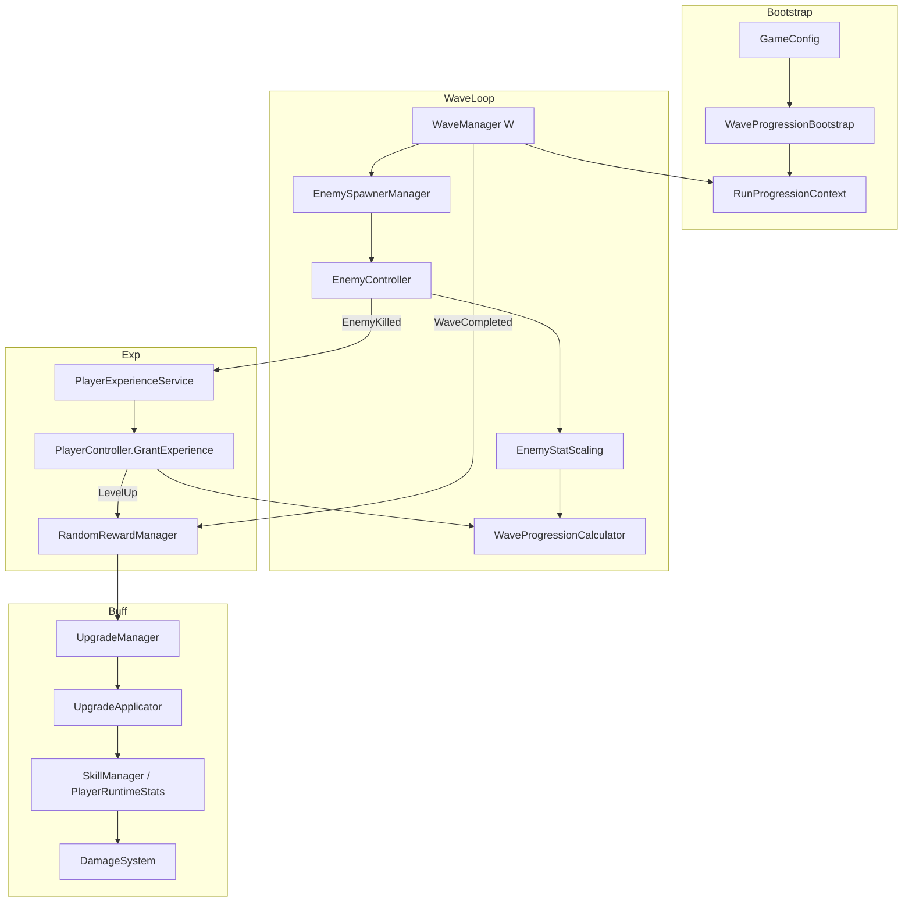

# 局内波次成长与难度平衡：代码实现说明

| 项 | 内容 |
|----|------|
| 版本 | v1.0 |
| 状态 | 基于当前代码实现整理 |
| 关联文档 | `wave_scaling_progression_strategy.md`（设计稿）、`wave_system.md`、`upgrade_buff_selection_document.md`、`damage_system.md` |
| 核心代码 | `WaveProgressionCalculator`、`WaveProgressionConfigSO`、`RunProgressionContext`、`EnemyStatScaling`、`WaveManager`、`PlayerController`、`UpgradeManager` |

---

## 1. 总览

本项目局内成长以**波次序号 `W`**（`WaveManager.CurrentWaveIndex`）为主轴，玩家等级 `L` 为副轴。当 `GameConfig.useWaveProgressionV2 = true`（默认开启）且 `WaveProgressionConfigSO` 加载成功时，进入 **V2 曲线模式**（`RunProgressionContext.IsActive`）；否则回退到 `WaveDataSO.statScalePerWave` 的线性缩放。

三条曲线在运行时同步推进：

| 曲线 | 作用 | 主要配置 |
|------|------|----------|
| **敌人战斗强度** | HP、伤害、移速、攻速、暴击按独立幂函数增长 | `WaveProgressionConfigSO` 各 `*Curve` |
| **刷怪压力** | 间隔缩短、单波数量增加、精英/特殊怪概率上升 | 同上 `Spawn` / `Optional Spawn Chances` |
| **经验供需** | 升级门槛随 `L` 与 `W` 上升；击杀经验随波次与敌种权重上升 | `expBase` 等 / `expWaveCoeff` 等 |

叠加层（在 V2 曲线结果上再乘）：

```
最终敌人属性 = BaseStats（EnemyDataSO）
            × M_wave_attr(W)          // 分属性波次曲线
            × M_entry                 // WaveEnemyEntry.statMultiplier
            × M_map × M_difficulty    // MapRuntimeContext + RunDifficultyContext
            × M_elite                 // EliteModeConfigSO / 精英个体标记
```

经验与升级门槛另有难度修正 `RunDifficultyContext.ExpNeedDifficultyMult` / `ExpGainDifficultyMult`。

---

## 2. 开关与运行时上下文

### 2.1 启用条件

```text
RunProgressionContext.IsActive
  = GameConfig.UseWaveProgressionV2（默认 true）
  AND WaveProgressionConfigSO != null
```

- 配置资产：`Assets/Resources/Config/Wave/WaveProgression_Default.asset`
- 引导：`WaveProgressionBootstrap.ApplyFromGameConfig`（`GameBootstrapper` 调用）
- 当前波次：`WaveManager.StartWave` → `RunProgressionContext.SetCurrentWave(waveIndex)`

### 2.2 Legacy 回退

`RunProgressionContext.IsActive == false` 时：

| 系统 | 回退行为 |
|------|----------|
| 敌人属性 | `1 + (W-1) × statScalePerWave`（默认 0.08，全属性统一线性） |
| 刷怪间隔/数量 | 读 `WaveDataSO.spawnInterval` / `maxSpawnCount` |
| 击杀经验 | 仅 `EnemyDataSO.experienceReward`，无波次倍率 |
| 升级需求 | `PlayerDataSO.experiencePerLevel` 固定值 |

---

## 3. 敌人属性随波次增长

### 3.1 公式（`WaveProgressionCalculator`）

**乘法属性**（HP、伤害、移速、攻速、护甲）：

\[
M_{attr}(W) = \mathrm{clamp}\bigl(1 + a_{attr} \cdot (W - 1)^{p_{attr}},\ 1,\ M^{max}_{attr}\bigr)
\]

`MaxMultiplier = 0` 表示不设上限。

**加法属性**（暴击率、暴击伤害）：

\[
Bonus_{attr}(W) = \min\bigl(a_{attr} \cdot (W - 1)^{p_{attr}},\ Cap\bigr)
\]

写入快照时：`snapshot.Set(stat, snapshot.Get(stat) + bonus)`。

### 3.2 默认系数（`WaveProgression_Default.asset`）

| 属性 | 模式 | `a` | `p` | 上限 | 代码字段 |
|------|------|-----|-----|------|----------|
| MaxHp | 乘法 | 0.10 | 1.30 | 无 | `hpCurve` |
| Damage / 元素伤害 | 乘法 | 0.08 | 1.25 | 无 | `damageCurve` |
| MoveSpeed | 乘法 | 0.025 | 1.15 | **×1.45** | `moveSpeedCurve` |
| AttackSpeed / AttackSpeedMulti | 乘法 | 0.03 | 1.20 | **×1.35** | `attackSpeedCurve` |
| CritChance | 加法 | 0.004 | 1.10 | **+0.15** | `critChanceCurve` |
| CritPower | 加法 | 0.02 | 1.10 | **+0.40** | `critPowerCurve` |

设计意图：**HP、伤害增长最快**；移速、攻速温和增长并封顶，避免后期不可交互；暴击用加法 + 硬上限，防止敌人秒杀城墙。

### 3.3 应用管线（`EnemyController.ApplyScaledStats`）

1. 从 `EnemyDataSO.BaseStats` 复制到 `scaledSnapshot`
2. `EnemyStatScaling.ApplyWaveScaling(snapshot, spawnWaveIndex, waveStatMultiplier, cfg)`
   - `waveStatMultiplier` = 条目倍率 × 地图倍率 × 难度倍率（在 Spawner 层叠乘后传入）
3. `ApplyEliteScaling()`：精英模式全局或精英个体额外倍率
4. `ConfigStatBridge.ApplyToEntityStats` → `Entity_Stats`

近战伤害 `contactDamage` 来自配置，随 `Damage` 属性一并缩放。

### 3.4 参考数值（默认配置，普通蝙蝠 `HP₀=30, DMG₀=10`）

| W | HP 倍率 | 伤害倍率 | 移速倍率 | 攻速倍率 | +暴击率 | +暴伤 | 蝙蝠 HP | 蝙蝠伤害 |
|---|--------|---------|---------|---------|--------|------|--------|---------|
| 1 | ×1.00 | ×1.00 | ×1.00 | ×1.00 | +0% | +0 | 30 | 10 |
| 5 | ×1.61 | ×1.45 | ×1.12 | ×1.16 | +1.8% | +0.09 | 48 | 15 |
| 10 | ×2.74 | ×2.25 | ×1.31 | ×1.35 | +4.5% | +0.22 | 82 | 23 |
| 15 | ×4.09 | ×3.17 | ×1.45 | ×1.35 | +7.3% | +0.36 | 123 | 32 |
| 20 | ×5.60 | ×4.17 | ×1.45 | ×1.35 | +10.2% | +0.40 | 168 | 42 |

### 3.5 精英与 Boss 叠加

| 层 | 来源 | 默认倍率 |
|----|------|----------|
| 精英模式全局 | `EliteModeConfigSO` | HP×1.5, ATK×1.3, MS×1.1, AS×1.15 |
| 精英个体 | `eliteEnemyBonusMultiplier` | 在波次倍率之上再 ×1.25 |
| Boss | `BossController` + 同上波次缩放 | 使用基础敌人配置 + Boss 技能/额外经验 |

精英模式还使：升级门槛 ×1.05、击杀经验获得 ×1.05（`RunDifficultyContext`）。

---

## 4. 刷怪速度与单波数量

### 4.1 刷怪间隔

\[
Interval(W) = \max\bigl(I_{min},\ I_0 \cdot \rho^{\,W-1}\bigr) \times M^{map}_{interval}
\]

| 参数 | 默认值 | 字段 |
|------|--------|------|
| `I₀` | 1.5 s | `spawnIntervalBase` |
| `ρ` | 0.965 | `spawnIntervalDecay` |
| `I_min` | 0.35 s | `spawnIntervalMin` |

`WaveManager.TrySpawnByInterval`：计时达到 `GetEffectiveSpawnInterval()` 且未达数量上限时生成一只普通怪。

### 4.2 单波最大刷怪数

\[
Count(W) = \min\bigl(C_{max},\ \mathrm{round}(C_0 + \Delta_c \cdot (W - 1)) \cdot M^{map}_{count}\bigr)
\]

| 参数 | 默认值 | 字段 |
|------|--------|------|
| `C₀` | 20 | `spawnCountBase` |
| `Δ_c` | +3 / 波 | `spawnCountPerWave` |
| `C_max` | 80 | `spawnCountMax` |

### 4.3 精英 / 特殊怪概率

每成功生成一只普通怪后，独立判定：

\[
P_{elite}(W) = \mathrm{clamp}\bigl(P_{0,elite} + 0.004 \cdot (W-1),\ 0,\ 0.25\bigr)
\]
\[
P_{special}(W) = \mathrm{clamp}\bigl(P_{0,special} + 0.005 \cdot (W-1),\ 0,\ 0.30\bigr)
\]

`P₀` 来自 `WaveDataSO`（如 `WaveData_01` 默认 elite=0.08, special=0.12）。

### 4.4 波次时长与完成条件

**实现注意**：`WaveProgressionCalculator.GetWaveDuration` 已定义「每 5 波 +5 s、上限 45 s」，但 **`WaveManager` 当前固定使用 `GameConstants.Progression.WaveDurationSeconds = 30`**，尚未接入配置曲线。

波次完成（`TryCompleteWave`）满足其一：

1. 已刷满 `Count(W)` 且场上无存活敌人（Boss 条件满足）
2. 仅 Boss 波：Boss 被击败
3. **超时 30 s**

升级选单结束后：`advanceWaveAfterUpgrade` 为 true 则 `StartWave(W+1)`，否则恢复当前波。

### 4.5 刷怪参考表

| W | 间隔 (s) | 最大数量 | 30s 内理论 tick 数 |
|---|----------|----------|-------------------|
| 1 | 1.50 | 20 | ~20 |
| 5 | 1.30 | 32 | ~23 |
| 10 | 1.09 | 47 | ~27 |
| 15 | 0.91 | 62 | ~33 |
| 20 | 0.76 | 77 | ~39 |

实际生成受 `PerformanceManager` 敌人预算、`MapRuntimeContext.PauseSpawns`、Boss 暂停刷怪等限制。

### 4.6 地图修正（`MapRuntimeContext`）

| 倍率 | 来源 |
|------|------|
| `EnemyStatMultiplier` | 地图 × 局内事件 |
| `SpawnIntervalMultiplier` | 地图 × 事件 |
| `MaxSpawnCountMultiplier` | 仅地图 |

---

## 5. 玩家升级所需经验

### 5.1 公式（`WaveProgressionCalculator.GetNeedExperience`）

升级门槛**仅随玩家等级 `L` 递增**，与当前波次 `W` **无关**。波次只影响击杀经验供给（见 §6），不改变「某级升下一级需要多少经验」。

**等级曲线**：

\[
NeedExp(L) = NeedExp_{base}(L) \cdot D_{exp}
\]

\[
NeedExp_{base}(L) = E_0 \cdot L^{g} \cdot \exp\bigl(\lambda \cdot \max(0,\, L - L_0)\bigr)
\]

| 参数 | 默认值 | 字段 |
|------|--------|------|
| `E₀` | 80 | `expBase` |
| `g` | 1.35 | `expGrowthPower` |
| `λ` | 0.02 | `expLambda` |
| `L₀` | 8 | `expLambdaStartLevel` |

`D_exp` = `RunDifficultyContext.ExpNeedDifficultyMult`（开局难度档位，非波次内变化）：

| 游戏难度 | 倍率 | 精英模式额外 |
|----------|------|-------------|
| 简单 (0) | ×0.95 | ×1.05 |
| 普通 (1) | ×1.00 | ×1.05 |
| 困难 (2) | ×1.05 | ×1.05 |

### 5.2 升级流程（`PlayerController.GrantExperience`）

1. 实际获得 = `baseAmount × (1 + ExperienceGain)`（经验**仅来自击杀**，见 `PlayerExperienceService`）
2. 当 `CurrentExperience >= NeedExp(L)`：标记升级待选、等级 +1、发布 `PlayerLevelUp`
3. 单次击杀最多升一级；升级三选一确认后经验**归零**，溢出经验不结转

触发 Roguelike 三选一：`RandomRewardManager` 监听 `PlayerLevelUp` 与 `WaveCompleted`。

### 5.3 升级需求参考表（普通难度，任意波次相同）

| 等级 L→L+1 | NeedExp |
|-----------|---------|
| 1→2 | 80 |
| 3→4 | 353 |
| 5→6 | 703 |
| 8→9 | 1,325 |
| 10→11 | 1,864 |

波次推进时，同一等级的升级门槛保持不变；后期升级节奏由**等级曲线**与**随波次增加的经验供给**共同决定。

---

## 6. 击杀经验与每波经验供给

### 6.1 单怪击杀经验

\[
Exp_{kill} = \mathrm{round}\Bigl(E_{base} \cdot M_{exp}(W) \cdot w_{type} \cdot D_{gain}\Bigr)
\]

\[
M_{exp}(W) = 1 + a_{exp} \cdot (W - 1)^{p_{exp}}
\]

| 参数 | 默认值 | 说明 |
|------|--------|------|
| `E_base` | 敌人配置 `experienceReward` | 如蝙蝠 = 5 |
| `a_exp` | 0.06 | `expWaveCoeff` |
| `p_exp` | 1.20 | `expWavePower` |
| `w_type` | 见下表 | `EnemyController.ResolveExperienceTypeWeight` |
| `D_gain` | `ExpGainDifficultyMult` | 简单 ×1.10，困难 ×0.95 |

**敌种权重**（`WaveProgressionConfigSO`）：

| 类型 | `w_type` | 备注 |
|------|----------|------|
| 普通 | 1.0 | `normalEnemyExpWeight` |
| 特殊 | 1.5 | `specialEnemyExpWeight` |
| 精英个体 | 2.0 | `eliteEnemyExpWeight` |
| Boss | 1.0 + `BossDataSO.bonusExperience` | 权重后另加固定奖励 |

经验来源：**仅击杀**（`PlayerExperienceService` 订阅 `EnemyKilled`）。`passiveExpPerSecond = 6` 已在配置中定义，**代码尚未接入**。

### 6.2 单波经验估算

粗算（普通怪 `E_base=5`，击杀率 85%）：

\[
Exp_{wave} \approx Count(W) \times Exp_{kill}(W) \times 0.85
\]

| W | `M_exp` | 单怪经验 | 最大数量 | 估算单波经验 |
|---|---------|----------|----------|-------------|
| 1 | ×1.00 | 5 | 20 | ~85 |
| 5 | ×1.24 | 6 | 32 | ~190 |
| 10 | ×1.62 | 8 | 47 | ~360 |
| 15 | ×1.96 | 10 | 62 | ~527 |
| 20 | ×2.28 | 11 | 77 | ~716 |

实际更高：精英/特殊怪权重、Boss 奖励、广告全选额外升级（间接提高清怪效率）。

### 6.3 经验增速 vs 敌人 HP 增速

| W | HP 倍率 (≈) | 击杀经验倍率 (≈) | 数量倍率 | 单波总经验倍率 (≈) |
|---|------------|-----------------|---------|-------------------|
| 1→10 | ×2.74 | ×1.62 | ×2.35 | **×4.2** |
| 1→20 | ×5.60 | ×2.28 | ×3.85 | **×8.8** |

**设计约束**：`a_exp (0.06) < a_hp (0.10)`，单怪「经验/HP」比随波次下降，玩家必须依赖 **Buff 成长** 维持击杀效率；但总击杀数上升，使升级节奏仍跟得上波次推进。

---

## 7. 玩家 Buff 与伤害成长

### 7.1 升级触发与频率

| 触发 | 行为 | 代码 |
|------|------|------|
| 击杀攒满 `NeedExp` | 局内三选一 | `PlayerLevelUp` → `RandomRewardManager` |
| 波次完成 | 局内三选一，然后 `W+1` | `WaveCompleted` |
| 每累计 4 次选单 | 强制基础属性 Buff 池 | `buffEventCounter` + `StatBuffCycleThreshold=4` |

每波至少 1 次选单（波次完成）；击杀效率高时同波可额外触发升级选单。

### 7.2 Buff 类型与数值

**全局属性 Buff**（`SkillBuffKind.Global*`）通过 `SkillManager.ApplyGlobalStatBuff` 写入 `PlayerController` 属性修正：

| Buff | 效果 | 单档数值（T1–T5） |
|------|------|-------------------|
| GlobalBaseDamage | `StatType.Damage` PercentAdd | +10% / +20% / … / +50% |
| GlobalAttackSpeed | `StatType.AttackSpeedMulti` PercentAdd | 同上 |
| GlobalCritChance | `StatType.CritChance` PercentAdd | 同上 |
| GlobalCritDamage | `StatType.CritPower` PercentAdd | 同上 |
| GlobalCooldownReduction | 全技能 CD ×(1-pct) | 同上 |

档位表：`SkillBuffCatalog.PercentTiers = {0.1, 0.2, 0.3, 0.4, 0.5}`。

**技能专属 Buff**（弹道数、穿透、连锁等）写入各技能 `SkillBuffProfile`，施法时由 `SkillContext` 读取：

```text
最终技能伤害 = GetBaseDamage(config) × runtime.GetDamageMultiplier() × skillMultiplier
```

`runtime.GetDamageMultiplier()` 含 `GlobalBaseDamage` 等对 `DamageMultiplier` 的叠加（`SkillBuffCatalog` 对 profile 做 `+= GetStackPercent(tier)`）。

**属性 Buff 资产**（`BuffDataSO`）与 **直接修正**（`UpgradeOptionSO.DirectModifiers`）经 `UpgradeApplicator` 应用。

### 7.3 玩家伤害 vs 敌人 HP 的隐含平衡

设玩家仅拿 **k 次** `GlobalBaseDamage T1`（每次 +10% 伤害，`PercentAdd` 叠加入 `StatType.Damage`）：

| 累计选取 | 伤害倍率 (约) | 对 W=10 蝙蝠 (HP≈82) 的等效击杀难度 |
|----------|--------------|-------------------------------------|
| 0 | ×1.0 | 基准 |
| 3 | ×1.3 | 抵消约 HP×2.74 的 11% |
| 6 | ×1.6 | 抵消约 23% |
| 10 | ×2.0 | 抵消约 37% |

敌人 W=1→10 HP 约 **×2.74**；若 10 波内获得 ~12–15 次有效伤害向 Buff（含技能专属、暴击、攻速），综合 DPS 可与之匹配。这是 **Roguelike 构筑** 而非纯数值等比缩放。

伤害结算管线见 `DamageSystem`：基础伤害 → 技能倍率 → 护甲 → 暴击 → 最终伤害（`damage_system.md`）。

### 7.4 与升级门槛的协同

- **门槛主控**：等级曲线 `L^1.35` 决定中后期升级变慢（与波次无关）
- **供给主控**：`Count × Exp_kill(W)` 随波次显著上升，高波次每波可获经验更多
- **四循环属性池**：防止玩家连续选技能专属而基础面板过低（`UpgradeManager.ShouldForceBasicAttributeBuffPool`）

---

## 8. 波次难度设计策略（本项目）

### 8.1 多轴压力模型

```text
感知难度 ≈ f(敌人硬度, 敌人 DPS, 同屏密度, 生成频率, 特殊机制占比)
```

| 轴 | 随波次变化 | 封顶/约束 |
|----|-----------|-----------|
| 单怪硬度 | HP、伤害幂函数 | 移速 ×1.45、攻速 ×1.35 |
| 数量 | 线性 +3/波，max 80 | 性能预算 `PerformanceManager` |
| 频率 | 指数衰减间隔，min 0.35s | 地图可再乘间隔 |
| 机制 | 精英/特殊概率线性增 | max 25% / 30% |
| 玩家成长 | 升级选单 + 技能解锁 | 互斥组、tier 上限 |

### 8.2 经验—难度张力

目标节奏（设计校验，需 Playtest 实测）：

- **W=10** 时，积极清怪玩家 **L ≈ 7–9**
- 若等级偏高：降低 `a_exp` 或提高 `E₀` / `g`
- 若等级偏低：提高 `a_exp` 或 `Count` / 降低 `E₀`
- **优先调经验供需，再调 HP 系数**（避免「又肉又穷」或「又脆又富」）

### 8.3 难度档位分工

| 维度 | 简单 | 普通 | 困难 | 精英模式 |
|------|------|------|------|----------|
| 敌人属性 | ×0.90 | ×1.00 | ×1.12 | +EliteModeConfig |
| 升级门槛 | ×0.95 | ×1.00 | ×1.05 | ×1.05 |
| 击杀经验 | ×1.10 | ×1.00 | ×0.95 | ×1.05 |

困难：**怪更硬、升级更慢、经验更少**；简单相反。精英模式在普通基础上全面加压。

### 8.4 已知实现缺口（调参时注意）

| 项 | 状态 |
|----|------|
| V2 分属性曲线 | ✅ 已实现 |
| 波次可变时长 `GetWaveDuration` | ⚠️ 已计算，**WaveManager 仍固定 30s** |
| 被动时间经验 `passiveExpPerSecond` | ⚠️ 配置存在，**未接入 Tick** |
| Legacy 线性缩放 | ✅ 作 V2 关闭时回退 |

---

## 9. 与主流肉鸽游戏的策略对比

### 9.1 对照总表

| 维度 | Vampire Survivors | Brotato / 土豆兄弟 | 20 Minutes Till Dawn | **本项目** |
|------|-------------------|-------------------|----------------------|-----------|
| 时间轴 | 实时分钟 | 离散波次 | 实时分钟 | **离散波次 W** |
| 敌人 scaling | 时间阶段表 | 每波独立乘区 | 分钟分段倍率 | **幂函数分属性曲线** |
| 刷怪 | 频率+同屏上限双轨 | 波次数量阶梯 | 时间窗密度 | **间隔指数衰减 + 数量线性增** |
| 玩家成长 | 升级经验幂次上升 | 波间商店/属性 | 升级+武器 | **击杀经验 + 波次/升级双触发三选一** |
| 构筑节奏 | 前期快升、武器协同 | 每波结束选属性 | 武器+天赋 | **每 4 选强制基础属性池** |
| 难度封顶 | 同屏上限 | 波次表驱动 | 精英乘区 | **移速/攻速/暴击硬上限** |

### 9.2 共性设计原则（行业惯例 vs 本项目落地）

1. **分属性斜率**  
   - 行业：HP/伤害涨得快，移速/攻速慢涨或封顶（VS、Brotato 均如此）  
   - 本项目：`hpCurve`/`damageCurve` 系数显著高于 `moveSpeedCurve`/`attackSpeedCurve`，并设 `maxMultiplier`

2. **经验曲线低于血量曲线**  
   - 行业：避免「刷怪即升级」失控；VS 后期单级需求陡增  
   - 本项目：`a_exp < a_hp`，且 `NeedExp` 随 `L^1.35` 指数级上升

3. **密度与间隔双轨加压**  
   - 行业：仅涨属性易「空窗」；仅涨数量易 FPS 崩  
   - 本项目：`spawnIntervalDecay` + `spawnCountPerWave` 组合，且有 `spawnCountMax`、`spawnIntervalMin`

4. **构筑窗口**  
   - 行业：前期快速选 Buff 建立手感（VS 前 5 分钟、Brotato 前几波）  
   - 本项目：低等级 `NeedExp` 小 + W 前段单波经验够升 1–2 级；`StatBuffCycleThreshold` 保证基础面板

5. **精英/特殊怪作为「变量」**  
   - 行业：精英掉落或经验更好，但威胁更高  
   - 本项目：`w_type` 1.5/2.0 补偿难度，概率随波次上升

6. **难度可选**  
   - 行业：多难度调整敌人与奖励  
   - 本项目：`RunDifficultyContext` 三分档 + 精英模式独立 SO

### 9.3 本项目的差异化取舍

- **塔防语境**：敌人攻击城墙而非玩家走位，移速/攻速封顶比 VS 更关键（保证可拦截、可读性）
- **双通道升级**：击杀升级 + 波次结束升级，比纯时间驱动（VS）更贴近 Brotato 波次节奏
- **技能 Buff 表驱动**：`SkillBuffCatalog` 集中管理 tier 数值，便于与 Meta 天赋 tier 对齐（`MetaSkillBuffProgressResolver`）
- **配置化曲线**：策划改 `WaveProgression_Default.asset` 即可，无需改 `WaveDataSO` 每波条目

---

## 10. 调参入口与代码索引

| 调参目标 | 资产 / 类 |
|----------|-----------|
| 全局曲线 | `Assets/Resources/Config/Wave/WaveProgression_Default.asset` |
| V2 开关 | `GameConfig.useWaveProgressionV2` |
| 敌种基础经验/属性 | `Assets/Resources/Config/Enemy/EnemyData_*.asset` |
| 波次敌人池 / P₀ 精英概率 | `WaveDataSO` |
| 地图修正 | `MapDataSO.WaveModifiers` |
| 精英模式 | `EliteModeConfigSO` |
| 升级选项与权重 | `UpgradeOptionSO` / `RewardPoolSO` |
| 全局 Buff 档位 | `SkillBuffCatalog.PercentTiers` |
| 波次时长（待接入） | `GameConstants.Progression.WaveDurationSeconds` 或 `GetWaveDuration` |

**核心纯函数**（建议单元测试覆盖）：

- `WaveProgressionCalculator.GetNeedExperience`
- `WaveProgressionCalculator.GetKillExperience`
- `WaveProgressionCalculator.GetStatMultiplier` / `GetStatAdditiveBonus`
- `WaveProgressionCalculator.GetSpawnInterval` / `GetMaxSpawnCount`

---

## 11. 附录：数据流简图



---

*文档根据仓库 `Assets/Scripts` 与 `WaveProgression_Default.asset` 当前实现整理；若代码变更请以 `WaveProgressionCalculator` 及 `RunProgressionContext.IsActive` 分支为准。*
