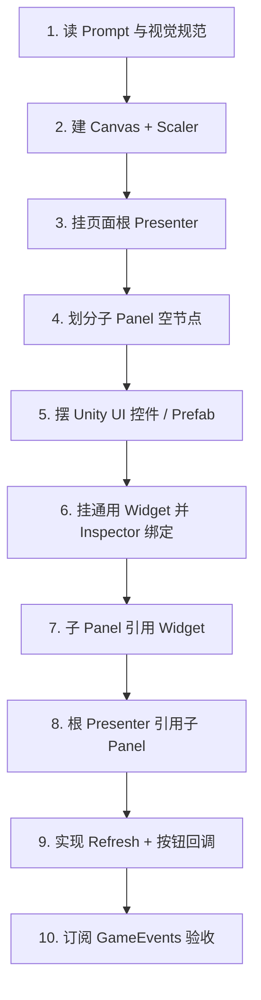

# UI 架构与工作流

> 配套：`prompt_ui_system.md`、`prompt_main_scene_ui.md`、`main_scene_ui_architecture_refactor.md`

## 1. 设计原则

| 原则 | 说明 |
|------|------|
| Inspector 优先 | 使用 Unity 自带 `Image` / `TMP_Text` / `Slider` / `Button` / `Canvas`，在 Inspector 拖拽绑定，**运行时不用代码 `new GameObject` 搭 UI** |
| 页面 Presenter | 每个页面一个根脚本（如 `MainSceneView`），只负责编排、事件订阅、调用 Manager |
| 子区域 Panel | 按布局区域拆子 Panel（如 `MainSceneResourcePanel`），各自 `Refresh` |
| 通用 Prefab 组件 | 统一格式的控件用可复用 Widget（如 `GeneralCardPanel`、`UI_ItemSlot`） |
| 特殊自定义 | 布局或交互唯一的块单独写 Panel（如七日登录 Banner 尺寸） |
| 事件驱动刷新 | 订阅 `GameEvents`，在显示/点击/事件后刷新，禁止每帧刷 TMP |

Editor 菜单（如 `MainSceneBuilder`）仅作**初始场景样板**，正式资源由美术在 Scene/Prefab 中替换 Sprite 并重新绑定字段。

## 2. 脚本分层

```
页面根 Presenter (MainSceneView / GameplayHudPresenter)
    ├── 子 Panel (MainSceneCardPanel, MainSceneResourcePanel, …)
    │       └── 通用 Widget (GeneralCardPanel, UI_ItemSlot, GeneralRewardCardPanel)
    └── 共享 Core (UiPanelBase, UiCanvasScalerSetup, UiTechWastelandPalette)
```

| 层级 | 命名建议 | 职责 |
|------|----------|------|
| 页面 | `*View` / `*PanelUI` | 订阅事件、分发 `MainSceneAction`、切场景 |
| 子 Panel | `MainScene*Panel` | 一块 UI 区域的刷新与红点 |
| 通用 Widget | `General*` / `UI_*` | 单槽位展示与点击，可做成 Prefab |
| 全局面板基类 | `UiPanelBase` | 弹层显隐、过渡动画 |

## 3. 搭建流程（推荐顺序）



### 步骤说明

1. **定义页面根**：在 Canvas 或全屏 Panel 上挂 `MainSceneView`，配置 `Canvas`、`CanvasScaler`（参考 1080×1920）。
2. **划分子区域**：按设计稿建空节点，例如 `TopProfile`、`TopResources`、`LeftSideIcons`、`RewardRow`、`BottomNav`。
3. **子 Panel 脚本**：每个区域挂对应 `MainScene*Panel`，字段只包含该区域控件或 Widget 数组。
4. **通用 Prefab**：复制 `GeneralCardPanel`（图标按钮）、`UI_ItemSlot`（资源条）、`GeneralRewardCardPanel`（奖励条）。
5. **关联**：子 Panel 的 `[SerializeField]` 指向子物体上的 Widget；`MainSceneView` 的 `[SerializeField]` 指向各子 Panel。
6. **业务**：根 Presenter 在 `OnEnable` 订阅事件，调用 `RefreshAll()` → 各子 Panel 的 `Refresh(...)`。
7. **点击**：Widget 抛出点击 → 子 Panel 汇总为 `MainSceneAction` → 根 Presenter `HandleAction`。

## 4. 通用组件约定

### `UI_RedDot`

- 挂载：红点 `GameObject` 或子 Image 根。
- API：`SetVisible(bool)`。

### `GeneralCardPanel`（图标按钮 Prefab）

- 结构：`Button` + `Image` 背景 + `Image` 图标 + `TMP_Text` 标题/副标题/消耗 + `UI_RedDot`。
- 配置：`MainSceneAction action`（页面内唯一）。
- API：`SetTexts`、`SetRedDot`、`BindClick`。

### `UI_ItemSlot`（资源条 Prefab）

- 结构：`Image` 图标 + `TMP_Text` 数值 + `Button` 加号。
- 配置：`CurrencyType currency`。
- API：`SetValue`、`BindAddClick`。

### `GeneralRewardCardPanel`（奖励条 Prefab）

- 结构：同卡片按钮，额外 `timerText`、`statusText`。
- API：`SetRewardDisplay(title, timer, status)`、`SetRedDot`。

## 5. MainScene 区域映射

| 设计区域 | 子 Panel | 使用的 Widget |
|----------|----------|----------------|
| 左上头像/等级/经验 | `MainSceneProfilePanel` | 直接绑定 Slider/TMP |
| 顶部资源条 | `MainSceneResourcePanel` | `UI_ItemSlot` ×4 |
| 顶右邮件/好友/设置 | `MainSceneCardPanel`（TopSystem） | `GeneralCardPanel` |
| 促销/侧边/底栏/开始战斗 | `MainSceneCardPanel`（分组字段） | `GeneralCardPanel` |
| 在线/通关/离线奖励 | `MainSceneRewardPanel` | `GeneralRewardCardPanel` ×3 |

详见 `main_scene_ui_architecture_refactor.md`。

## 6. 与 Manager / 事件

- 读档：`ResourceManager` / `SaveManager`。
- 签到/离线：`DailyRewardManager`、`ShopManager`。
- 订阅：`GameEvents` 资源、签到、成就、商店；`OnDisable` 必须反订阅。
- 禁止：在 UI 中 `FindObjectOfType`、直接改战斗实体、每帧 `RefreshAll`。

## 7. 验收清单

- [ ] 打开 MainScene，默认数据与红点显示正常。
- [ ] 资源变化、签到、商店事件触发后 UI 刷新。
- [ ] 开始战斗进入 `BattleScene`。
- [ ] 所有入口有 `MainSceneAction`，未接入功能有状态栏提示。
- [ ] Inspector 可单独替换某个 `GeneralCardPanel` Prefab 而不改代码。

## 8. 扩展新页面

1. 新建 `XxxSceneView` + `prompt_xxx_scene_ui.md`（可选）。
2. 复制通用 Widget Prefab，只做布局差异部分自定义 Panel。
3. 在 `module_prompt_index.md` L4 登记文档链接。
