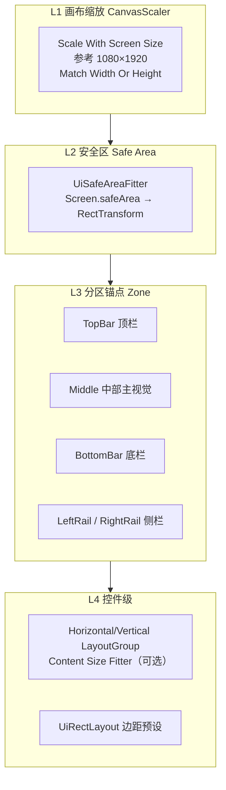

# Main Scene 移动端 UI 适配方案设计

> 配套：`prompt_main_scene_ui.md`、`ui_architecture_workflow.md`、`UiCanvasScalerSetup`  
> 目标：在 Unity UI 控件搭建完成后，**同一套 Prefab/Scene 布局**可在主流竖屏手机上稳定显示，无需为每台设备单独摆坐标。

---

## 1. 问题与根因

### 1.1 现象

| 现象 | 典型机型 |
|------|----------|
| 顶部头像/资源条贴到状态栏或被刘海遮挡 | iPhone 14 Pro、华为挖孔 |
| 底部导航/开始战斗按钮超出屏幕或贴底 Home 条 | iPhone X 系列、全面屏 Android |
| 左右侧边按钮在窄屏上挤出可视区 | 20:9 长屏（1080×2400） |
| 在 iPad/平板模拟器上两侧留白过大、中部控件过小 | 4:3、16:10 |

### 1.2 当前 MainScene 布局特征（需迁移）

`MainSceneBuilder` 与现有 `MainScene.unity` 中大量控件使用：

- **锚点**：`anchorMin = anchorMax = (0.5, 0.5)`（屏幕中心）
- **定位**：`anchoredPosition` 使用**设计稿像素**（如 `y = 850`、`-855`）
- **缩放**：仅依赖 `CanvasScaler`（1080×1920，`matchWidthOrHeight = 0.5`）

中心锚点 + 绝对像素坐标在**参考分辨率**下看起来正确，但当：

1. 屏幕**宽高比**偏离 9:16（更长或更方），  
2. **Safe Area**（刘海、圆角、Home Indicator）占用上下边距，  
3. `matchWidthOrHeight` 在「按宽缩放」与「按高缩放」之间折中时，

各控件相对**屏幕边缘**的距离不再恒定，就会出现「有的手机挤在一起、有的手机够不着」的差异。

### 1.3 设计原则（一句话）

> **先定屏幕边缘与安全区，再在区域内用锚点 + 边距排布；禁止用中心锚点模拟「距顶/距底多少像素」。**

---

## 2. 适配架构总览

采用 **四层流水线**，自外向内依次解决「整体缩放 → 系统安全区 → 分区布局 → 细部对齐」。



### 2.1 层级职责

| 层级 | 组件 | 职责 | 是否运行时改逻辑 |
|------|------|------|------------------|
| L1 | `Canvas` + `CanvasScaler` + `UiCanvasScalerSetup` | 将逻辑分辨率映射到物理屏，统一 UI 单位 | 仅 Awake 写 Scaler 参数 |
| L2 | `UiSafeAreaFitter` | 把 Unity `Screen.safeArea` 应用到安全区根节点 | 旋转/分辨率变化时刷新 |
| L3 | 分区空节点 + `UiRectLayout` | 顶/底/左/右/中区域相对父节点拉伸或贴边 | 一般仅搭建期配置 |
| L4 | `sizeDelta` / 边锚点 / `LayoutGroup` / `LayoutElement` | 子控件尺寸与排列；**继承 L1 统一 scale，不再单独缩放** | 搭建期配置 |

**Presenter 脚本（`MainSceneView`、各 `*Panel`）不参与布局计算**，只绑定引用与刷新数据，符合现有 UI 架构约束。

---

## 3. 推荐 Hierarchy（MainScene）

```
MainSceneUI [Canvas, CanvasScaler, UiCanvasScalerSetup, GraphicRaycaster, MainSceneView]
├── SpaceCityBackground          # Stretch 全屏，可 ignoreSafeArea
└── SafeAreaRoot [UiSafeAreaFitter]   # 所有交互 UI 的父节点
    ├── TopBar [UiRectLayout: TopStretch]
    │   ├── TopProfile
    │   ├── TopResources
    │   └── TopSystemIcons
    ├── TopPromotion [UiRectLayout: TopStretch + offset]
    ├── LeftRail [UiRectLayout: LeftStretch]
    │   └── LeftSideIcons
    ├── RightRail [UiRectLayout: RightStretch]
    │   └── RightSideIcons
    ├── MiddleContent [UiRectLayout: CenterStretch]
    │   └── CentralSkylinePanel
    ├── RewardRow [UiRectLayout: BottomStretch]
    │   └── Online / Stage / Offline 奖励
    ├── PrimaryAction [UiRectLayout: BottomCenter]
    │   └── StartBattleButton
    └── BottomNav [UiRectLayout: BottomStretch]
        └── Shop / 角色 / 战斗 / …
```

背景图若需「铺满含刘海区域」，放在 `SafeAreaRoot` **之外**；所有可点击控件放在 `SafeAreaRoot` **之内**。

---

## 4. 各层配置规范

### 4.1 L1：CanvasScaler（已有）

```text
UI Scale Mode     : Scale With Screen Size
Reference Resolution: 1080 × 1920
Screen Match Mode : Match Width Or Height
Match             : 0.5（默认；见 §5.2 调参）
```

由 `UiCanvasScalerSetup` 在 `Awake` 统一写入，避免场景里手工改漏。

**原理简述**：  
设参考分辨率 \(R_w \times R_h\)，当前屏幕逻辑尺寸 \(S_w \times S_h\)。

- `matchWidthOrHeight = 0` → 等价按**宽度**对齐，竖屏长机上 UI 整体略偏小，左右更贴边。  
- `= 1` → 按**高度**对齐，长机上 UI 略偏大，上下更易溢出。  
- `= 0.5` → 在两者之间插值，适合 9:16～20:9 混合机型。

### 4.2 L2：Safe Area

`Screen.safeArea` 返回**像素矩形**（左下为原点）。`UiSafeAreaFitter` 将其转换为父 `RectTransform` 下的 `anchorMin/Max` + `offsetMin/Max`，使子树布局区域 = 系统认定的「可交互安全区」。

| 平台 | 典型 inset |
|------|------------|
| iOS 刘海/灵动岛 | 顶 47～59 pt 量级（随机型变） |
| iOS Home Indicator | 底 ~34 pt |
| Android 挖孔/手势条 | 因 OEM 而异，Unity 统一走 safeArea |

`ProjectSettings` 中 `androidRenderOutsideSafeArea` 可为 1（背景可出血），但**按钮仍应在 SafeAreaRoot 内**。

### 4.3 L3：分区锚点（UiRectLayout 预设）

| 预设 | anchorMin | anchorMax | 典型用途 |
|------|-----------|-----------|----------|
| `FullStretch` | (0,0) | (1,1) | 全屏遮罩、Scrim |
| `TopStretch` | (0,1) | (1,1) | 顶栏、资源条 |
| `BottomStretch` | (0,0) | (1,0) | 底栏、奖励行 |
| `LeftStretch` | (0,0) | (0,1) | 左侧活动入口 |
| `RightStretch` | (1,0) | (1,1) | 右侧排行榜等 |
| `CenterStretch` | (0.5,0.5) | (0.5,0.5) + size | 中部主视觉（慎用固定 size） |
| `TopLeft` / `TopRight` / `BottomLeft` / `BottomRight` | 角锚点 | 单点悬浮按钮 |

每个预设配合 **padding**（四边距）与 **fixedSize**（条带高度/宽度）：

- 顶栏：`TopStretch`，`fixedSize.y = 220`，`padding.top = 8`  
- 底栏：`BottomStretch`，`fixedSize.y = 160`，`padding.bottom = 8`  
- 左右轨：`LeftStretch` / `RightStretch`，`fixedSize.x = 150`，`padding.left/right = 12`

子控件在分区内仍用**相对父分区**的锚点，例如顶栏内头像 `anchorMin=(0,1), anchorMax=(0,1), pivot=(0,1), anchoredPosition=(24,-24)`。

### 4.4 L4：LayoutGroup（可选）

| 区域 | 建议 |
|------|------|
| `TopResources` 四个资源条 | `HorizontalLayoutGroup` + `Child Force Expand Width=false` |
| `BottomNav` 五个 Tab | `HorizontalLayoutGroup`，`spacing=8`，`padding` 左右 16 |
| `RewardRow` 三张卡 | `HorizontalLayoutGroup`，`childAlignment=MiddleCenter` |

**注意**：LayoutGroup 与 `ContentSizeFitter` 同用易循环刷新；MainScene 以**固定设计尺寸 + 锚点**为主，Layout 仅用于同一行等距。

### 4.5 L4：子 UI 元素的等比例缩放（必读）

#### L1 是否已经「整体等比例缩放」？

**是，但是由 Canvas 统一完成的一次 uniform scale（X、Y 同系数），不是每个子物体单独算缩放。**

| 因素 | 本方案是否覆盖 | 说明 |
|------|----------------|------|
| 分辨率 / 屏幕逻辑宽高 | ✅ L1 | `Scale With Screen Size` 用 `Screen.width/height` 相对 1080×1920 算缩放系数 |
| 宽高比差异 | ✅ L1 + L2/L3 | L1 的 `matchWidthOrHeight` 在「按宽缩放」与「按高缩放」间插值，得到**单一** scale；L2/L3 负责安全区与贴边，避免长屏裁切 |
| 系统像素密度（DPI / dp） | ⚠️ 间接 | Unity UI **不按 Android dp 单独乘系数**；高 DPI 机若 `Screen.width` 更高，会体现在 L1 的 scale 里。字号用 TMP **逻辑字号**，随 Canvas 同比放大 |
| 刘海 / Home 条 | ✅ L2 | 与缩放无关，只改可布局矩形 |

公式（`Match Width Or Height` 模式）：

```text
scaleW = Screen.width  / 1080
scaleH = Screen.height / 1920
scale  = lerp(scaleW, scaleH, matchWidthOrHeight)   // 通常 0.5～0.65
```

整棵 UI 树在屏幕上被 **同一个 scale** 绘制；`RectTransform.sizeDelta`、`fontSize` 等数值都在**参考分辨率逻辑空间**里填写，运行时**不必**再给每个按钮写 `transform.localScale`。

> **不要**把 L4 理解成「再挂一层缩放组件」；L4 做的是：在已缩放的逻辑空间里，用 **sizeDelta + 锚点 +（可选）LayoutElement** 定大小与相对位置。

#### L4 子元素如何设置才会跟着等比例变大/变小？

默认规则：**子元素自动继承 L1 缩放，无需 `localScale`。**

| 设置项 | 推荐做法 | 效果 |
|--------|----------|------|
| 宽高 | `RectTransform.sizeDelta` 或拉伸锚点 `offsetMin/Max` | 随 Canvas scale 同比缩放 |
| 位置 | 相对**分区父节点**的边锚点 + `anchoredPosition` | 随父节点与 Canvas 同比缩放 |
| 字号 | TMP `fontSize` 用设计稿数值（如 24、36） | 随 Canvas 同比缩放 |
| 图标 | `Image` 勾选 Preserve Aspect；Sprite 用统一 PPU | 不变形，边长随 scale |
| 点击区域 | Button 的 `RectTransform` 尺寸 ≥ **88×88**（逻辑像素） | 缩放后仍满足最小触控 |

**三种 L4 尺寸模式（择一，不要混用 localScale）：**

1. **固定逻辑尺寸（最常用）**  
   - 例：`GeneralCardPanel` 底栏按钮 `sizeDelta = (180, 140)`，锚在 `BottomNav` 内。  
   - 换机后按钮整体同比变大/小，比例不变。

2. **随父区域拉伸**  
   - 例：顶栏背景 `anchorMin=(0,1), anchorMax=(1,1)`，高度用 offset 锁定。  
   - 父分区（L3）变宽时，子元素横向拉满；常用于条带背景、全宽 Slider。

3. **同区自适应（LayoutGroup）**  
   - 例：`HorizontalLayoutGroup` + 子物体 `LayoutElement.preferredWidth = 180`。  
   - 在**分区宽度变化**时均分或按比例分配，仍继承 L1 统一 scale。

#### L4 禁止与慎用

| 做法 | 原因 |
|------|------|
| ❌ 子 Button 上改 `transform.localScale` | 破坏 LayoutGroup、点击区域与字号比例 |
| ❌ 运行时按 `Screen.dpi` 手写乘系数 | 与 CanvasScaler 双重缩放 |
| ❌ 仅用中心锚点 + 超大绝对坐标 | 见 §6.2，长屏相对边缘漂移 |
| ⚠️ `Content Size Fitter` + `LayoutGroup` 同节点 | 易布局循环；仅文本气泡等需要 |

#### 需要「大屏更大、小屏更小」时的例外

若希望**偏离**统一 scale（例如平板字再大一点），仅在少数节点使用：

- `LayoutElement`：`minWidth` / `minHeight` 保证小屏可点；  
- TMP：`enableAutoSizing` + `fontSizeMin/Max`（文字不溢出，仍随 Canvas 基准缩放）；  
- **不要**默认上 `Canvas` 子 Canvas + 另一套 Scaler（复杂且易错）。

#### L4 检查清单（单个 Prefab / 控件）

- [ ] `localScale` 为 `(1,1,1)`  
- [ ] 尺寸写在 `sizeDelta` 或拉伸 offset，单位为 1080×1920 设计稿  
- [ ] 锚点相对**直接父分区**，不是相对屏幕中心  
- [ ] TMP / Image 未单独做 DPI 乘法  
- [ ] 在 720×1280 与 1080×2400 预览，触控区仍 ≥ 88 逻辑像素  

---

## 5. 主流设备与验证矩阵

### 5.1 建议 Game 视图分辨率

| 分类 | 分辨率 | 宽高比 | 验证重点 |
|------|--------|--------|----------|
| 基准 | 1080×1920 | 9:16 | 与设计稿一致 |
| 长屏 Android | 1080×2400 | 20:9 | 底栏、开始战斗不被裁切 |
| 长屏 Android | 1080×2340 | 19.5:9 | 同左 |
| iPhone 刘海 | 1170×2532 | ~19.5:9 | 顶栏不进刘海 |
| 小屏 | 720×1280 | 9:16 | 字号可读、按钮 ≥ 88×88 dp |
| 平板 | 1536×2048 | 4:3 | 左右留白可接受，中部不过小 |

Unity Device Simulator / 真机各测一轮：**顶栏、底栏、左右轨、主按钮** 均应在 Safe Area 内，且彼此不重叠。

### 5.2 Match Width Or Height 调参建议

| 项目类型 | 建议 match | 原因 |
|----------|------------|------|
| 本游戏 MainScene（竖屏 F2P） | **0.5～0.65** | 略偏高度，减少长屏底部裁切 |
| 横屏战斗 HUD | 0～0.35 | 偏宽度，保证左右技能栏 |

可在 `UiCanvasScalerSetup` 的 Inspector 中按场景微调，**不要**在业务 Presenter 里改。

---

## 6. UI 适配原理（深入）

### 6.1 坐标系链条

```text
屏幕像素 (Screen.width/height)
    → Canvas Scaler 缩放因子
    → Canvas 逻辑坐标 (参考分辨率空间)
    → 父 RectTransform 局部坐标
    → 子控件 anchoredPosition / sizeDelta
```

只要在**同一 Canvas 逻辑空间**内用**边锚点 + 边距**描述位置，Scaler 改变时控件会随父节点同比缩放，相对屏幕边缘的比例保持稳定。

### 6.2 为何中心锚点会失败

中心锚点 `(0.5, 0.5)` 下，`anchoredPosition.y = 850` 表示「相对屏幕中心向上 850 逻辑单位」：

- 屏幕**变高**时，中心点上移，但**顶部边缘**上移更多 → 控件离顶部的实际距离**变小**（易被刘海挡）。  
- 屏幕**变矮**时相反，底部控件可能**出屏**。

改为 `TopStretch` 且 `offsetMax.y = -24` 时，含义变为「距安全区顶边 24」，与屏幕总高度无关。

### 6.3 Safe Area 与 CanvasScaler 的关系

两者正交：

- **Scaler** 解决「不同分辨率下 UI 有多大」。  
- **Safe Area** 解决「UI 能摆在屏幕哪块矩形里」。

必须先 Scaler 再 Safe Area（SafeAreaRoot 是 Canvas 子物体，Scaler 作用在整个 Canvas 上）。

### 6.4 最小点击区域

移动端建议可点击区域 **≥ 88×88** 逻辑像素（约 44 pt @2x）。`GeneralCardPanel` 底栏、侧边入口在窄屏上不得低于此值，必要时缩小字号而非缩小 Button 的 `RectTransform`。

---

## 7. 搭建与迁移工作流

### 7.1 新页面（推荐顺序）

1. Canvas + `UiCanvasScalerSetup`（1080×1920）。  
2. 建 `SafeAreaRoot` + `UiSafeAreaFitter`。  
3. 按 §3 建分区空节点，挂 `UiRectLayout` 选预设与 padding。  
4. 在分区内摆 `Image` / `TMP` / `Button` / Prefab，**角/边锚点**对齐分区边缘。  
5. 挂 Presenter / Panel，Inspector 绑定字段。  
6. §5.1 分辨率 + 真机 Safe Area 验收。

### 7.2 现有 MainScene 迁移

1. 在 `MainSceneUI` 下插入 `SafeAreaRoot`，将原交互节点整体拖入（背景可留外）。  
2. 按区域创建 `TopBar` / `BottomNav` / `LeftRail` / `RightRail` / `MiddleContent`，逐个迁移子节点。  
3. 将原 `anchoredPosition` 转换为「相对分区边缘」的锚点 + offset（可用 Editor 工具批量辅助，见 `MainSceneAdaptationRefactor` 菜单）。  
4. 对比迁移前后在 1080×1920 的截图，再跑长屏/刘海用例。

### 7.3 禁止事项

- 禁止在 `MainSceneView` / `*Panel` 的 `Update` 里改 `RectTransform`（除 Safe Area 组件）。  
- 禁止用 `Screen.width` 手写乘系数摆 UI（难以维护，与 Scaler 双重缩放）。  
- 禁止仅依赖 `matchWidthOrHeight=1` 指望解决刘海（必须 Safe Area）。

---

## 8. 核心脚本 API

| 脚本 | 挂载位置 | 说明 |
|------|----------|------|
| `UiCanvasScalerSetup` | UI 根 Canvas | 统一 Scaler 参数 |
| `UiSafeAreaFitter` | `SafeAreaRoot` | 应用 `Screen.safeArea` |
| `UiRectLayout` | 各分区根节点 | 预设锚点 + padding，编辑器可预览 |

---

## 9. 验收清单

- [ ] 1080×1920 与设计稿布局一致（允许 ±8px 级误差）。  
- [ ] 1080×2400：底栏、开始战斗、状态文字完整可见。  
- [ ] iOS 模拟器 Safe Area：顶栏不进入刘海，底栏在 Home 条之上。  
- [ ] 720×1280：无文字重叠，红点与按钮可点。  
- [ ] 旋转（若锁定竖屏可跳过）：Safe Area 刷新正确。  
- [ ] Presenter 脚本无 `RectTransform` 布局逻辑。  
- [ ] 所有 Icon Button 仍为 `Button + Image + TMP + redDot` 结构。

---

## 10. 与现有文档关系

| 文档 | 关系 |
|------|------|
| `prompt_main_scene_ui.md` | 布局规范引用本文件 §4、§7 |
| `ui_architecture_workflow.md` | Core 层增加 SafeArea / RectLayout |
| `ui_scene_setup.md` | 全局 UICanvas 同样使用 L1+L2 |

---

## 11. 附录：中心锚点 → 边锚点换算思路

原：中心锚点，位置 `(px, py)`，参考高 `H=1920`。

- 距顶边距离：`top = H/2 - py`（当锚点在中心上方时 py>0）  
- 迁移后：`TopStretch`，`offsetMax.y = -top`，`offsetMin.y = -(top + height)`

左右同理：`left = W/2 + px`（px 为负表示在中心左侧）。

批量迁移宜在 Editor 中记录分区父节点，勿对全局坐标一次性硬编码。
