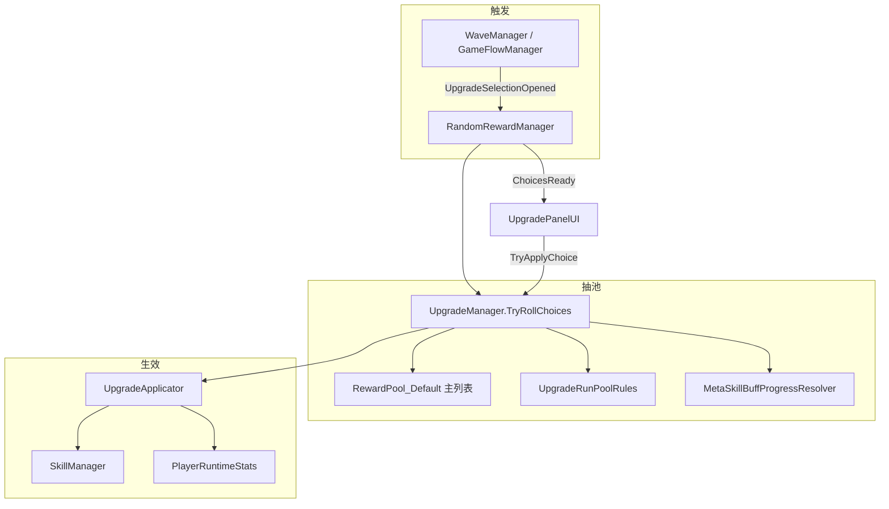
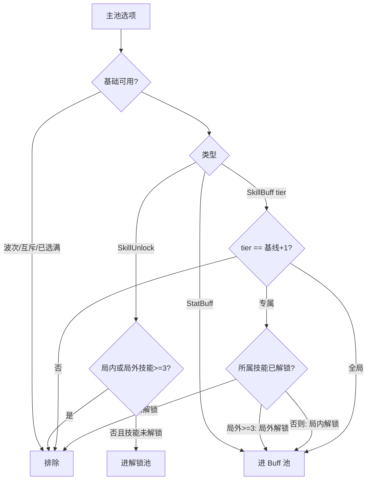

# 局内 Buff 三选一：核心逻辑与实现说明

本文档描述波次/升级后 **Roguelike 三选一** 的完整数据流，覆盖池过滤、tier 递进、局外永久成长衔接与效果叠加。对应需求见 `buff_upgrader_system.md`、`SkillBuff核心机制.md`。

---

## 架构总览



| 组件 | 路径 | 职责 |
|------|------|------|
| `RandomRewardManager` | `Assets/Scripts/Upgrade/RandomRewardManager.cs` | 监听升级事件，调用抽池并发布 UI 事件 |
| `UpgradeManager` | `Assets/Scripts/Upgrade/UpgradeManager.cs` | 主池收集、过滤、加权抽取、局内记录 |
| `UpgradeRunPoolRules` | `Assets/Scripts/Upgrade/Core/UpgradeRunPoolRules.cs` | 解锁卡 / 通用 / 专属 Buff 池规则 |
| `MetaSkillBuffProgressResolver` | `Assets/Scripts/Upgrade/Core/MetaSkillBuffProgressResolver.cs` | 局外永久 tier 基线、局外技能数统计 |
| `MetaProgressBuffBootstrap` | `Assets/Scripts/Upgrade/Core/MetaProgressBuffBootstrap.cs` | 开局施加存档中的永久 SkillBuff |
| `UpgradeApplicator` | `Assets/Scripts/Upgrade/Core/UpgradeApplicator.cs` | 将选中卡效果写入 Skill / Stat 系统 |
| `SkillManager` | `Assets/Scripts/SkillSystem/Core/SkillManager.cs` | SkillBuff Profile 与全局属性修正 |
| `PlayerRuntimeStats` | `Assets/Scripts/Player/PlayerRuntimeStats.cs` | StatBuff、天赋、装备、永久属性 Buff 聚合 |

---

## 1. 三选一选项生成逻辑

### 1.1 入口流程

1. `GameFlowManager` 进入 `UpgradeChoosing` → `GameEvents.RaiseUpgradeSelectionOpened`
2. `RandomRewardManager.OnUpgradeSelectionOpened` 构建 `UpgradeSelectionContext`（波次、等级、触发源）
3. `UpgradeManager.TryRollChoices`：
   - 解析 `RewardPool_Default`（或 ConfigDatabase 全库兜底）
   - `BuildRunEligiblePools` 拆成 **Buff 候选池** 与 **解锁卡候选池**
   - `RollChoices` 加权抽取 3 张不重复卡

### 1.2 三类卡在池中的归类

| 类型 | 判定 | 进入哪个子池 |
|------|------|--------------|
| 技能解锁卡 | `EffectType == SkillUnlock` | `unlockRollScratch` |
| 通用 Buff | `StatBuff` 或 `Global*` SkillBuffKind | `rollScratch`（Buff 池） |
| 技能专属 Buff | 非 Global 的 `SkillBuff` | `rollScratch`（Buff 池） |

核心分类代码：

```32:78:Assets/Scripts/Upgrade/Core/UpgradeRunPoolRules.cs
    public static bool IsStatBuffOption(UpgradeOptionSO option) =>
        option != null && option.EffectType == UpgradeEffectType.StatBuff;
    // ...
    public static bool IsGlobalBuffOption(UpgradeOptionSO option) { /* StatBuff 或 Global SkillBuffKind */ }
    public static bool IsSkillExclusiveBuffOption(UpgradeOptionSO option) { /* 非 Global 的 SkillBuff */ }
    public static bool IsSkillUnlockOption(UpgradeOptionSO option) =>
        option != null && option.EffectType == UpgradeEffectType.SkillUnlock;
```

### 1.3 抽取规则（`RollChoices`）

```376:425:Assets/Scripts/Upgrade/UpgradeManager.cs
    private void RollChoices(
        RewardPoolSO pool,
        int choiceCount,
        bool requireUnlockCard,
        List<UpgradeRollCandidate> buffCandidates,
        List<UpgradeRollCandidate> unlockCandidates)
    {
        // 1. 若 requireUnlockCard：先从 unlockCandidates 加权抽 1 张
        // 2. 再从 combined（Buff + 剩余解锁）加权抽满 choiceCount（默认 3）
        // 3. 每次选中后按 mutuallyExclusiveGroup 剔除同组候选
    }
```

**强制解锁卡条件**（本局与局外技能数均 < 3，且解锁池非空）：

```csharp
bool requireUnlockCard =
    runUnlockedCount < 3 &&
    metaUnlockedCount < 3 &&
    unlockRollScratch.Count > 0;
```

### 1.4 权重

- 默认取 `UpgradeOptionSO.Weight` 或 `RewardPoolSO` 条目 `weightOverride`
- 按 `UpgradeRarity` 衰减（Uncommon 0.75、Rare 0.5 …）

---

## 2. Buff 池生成与更新

### 2.1 主池来源

`CollectMasterUpgradeOptions` 优先级：

1. `RewardPool_Default.entries`（当前 119 项：通用 + 全 tier SkillBuff + 解锁卡）
2. `ConfigDatabase.upgradeOptions`
3. `Resources.LoadAll<UpgradeOptionSO>("Config/Upgrade")`

### 2.2 动态过滤（每次升级重新计算）

过滤入口 `UpgradeRunPoolRules.IsEligibleForRunPool`，在 `BuildRunEligiblePools` 中对主池每一项调用。



### 2.3 技能解锁与池范围

| 条件 | 解锁卡 | 专属 Buff 范围 |
|------|--------|----------------|
| 局内技能 < 3 且 局外 < 3 | 可出现；三选一**必含 1 张** | 仅**局内已解锁**技能的专属 Buff |
| 局内技能 ≥ 3 | 不出现 | 局内已解锁技能的专属 Buff |
| **局外技能 ≥ 3** | 不出现 | **局外已元解锁**技能的专属 Buff |

局外技能判定：`MetaSkillBuffProgressResolver.CountMetaUnlockedSkills` + `SkillUnlockService.IsMetaUnlocked`。

开局时 `SkillUnlockService.ApplyUnlocksToPlayerSkillManager` 会把局外已解锁技能同步到局内 `SkillManager`，因此多数情况下局内技能数与局外一致；局内解锁卡用于**局外尚未解锁**的技能在本局临时解锁（`persistToSave: false`）。

### 2.4 Tier 递进与池更新

`UpgradeManager` 维护 `skillBuffHighestTiers: Dictionary<SkillBuffKind, int>`：

- **初始化 / 新局开始**：`SeedMetaSkillBuffTiers()` 写入局外基线
- **局内选中 Buff**：`RecordSkillBuffTier` 取 `max(现有, 新 tier)`
- **读档恢复**：在基线之上叠加 `runProgress.selectedUpgrades`

下一档可进池条件：

```116:127:Assets/Scripts/Upgrade/Core/UpgradeRunPoolRules.cs
    public static bool IsNextTierOption(
        UpgradeOptionSO option,
        IReadOnlyDictionary<SkillBuffKind, int> skillBuffHighestTiers)
    {
        int highest = GetHighestSelectedTier(option.SkillBuffKind, skillBuffHighestTiers);
        return option.SkillBuffTier == highest + 1;
    }
```

**示例（穿透 ShootPierce）**

| 状态 | `skillBuffHighestTiers[ShootPierce]` | 可抽 tier |
|------|--------------------------------------|-----------|
| 局外无 | 0 | T1 |
| 局内选 T1 | 1 | T2 |
| 局内选 T2 | 2 | T3 |
| 已选 T3 | 3 | 无（该 Kind 无更高档） |

选中后**同 tier 卡不会再次出现**（`IsOptionAvailable` 对该 `configId` 的 `stackCount >= 1`）。

---

## 3. Buff 叠加与限制

### 3.1 类型对照

| Buff 类型 | 局内可选次数 | Tier 规则 | 效果叠加方式 |
|-----------|--------------|-----------|--------------|
| `StatBuff`（如 AttackUp） | `maxStacks`（默认 99） | 无 tier | 多次选中 → 多次 `ApplyBuff`，修饰符累加 |
| 全局 `SkillBuff`（四维 Global*） | 每 tier 卡 1 次 | T1→T2→… 递进 | 每档 `ApplyGlobalStatBuff` 追加 `PercentAdd` 修正 |
| 技能专属 `SkillBuff` | 每 tier 卡 1 次 | T1→T2→… 递进 | `SkillBuffCatalog.Apply` 写入 Profile（非简单叠层） |

`IsOptionAvailable` 中对 tier 卡强制 `effectiveMaxStacks = 1`：

```174:184:Assets/Scripts/Upgrade/UpgradeManager.cs
        if (UpgradeRunPoolRules.IsSkillBuffTierOption(option))
        {
            effectiveMaxStacks = 1;
        }
        if (GetStackCount(option.ConfigId) >= effectiveMaxStacks)
            return false;
```

### 3.2 效果应用（`UpgradeApplicator`）

```23:48:Assets/Scripts/Upgrade/Core/UpgradeApplicator.cs
        switch (option.EffectType)
        {
            case UpgradeEffectType.StatBuff:
                return ApplyStatBuff(option, skillManager);
            case UpgradeEffectType.SkillBuff:
            case UpgradeEffectType.WeaponEnhance:
                return ApplySkillBuff(option, skillManager);
            case UpgradeEffectType.SkillUnlock:
                return ApplySkillUnlock(option, skillManager); // persistToSave: false
        }
```

专属 Buff **不会**自动解锁技能；未解锁时 `ApplySkillBuff` 返回 false。

### 3.3 互斥组

同 `mutuallyExclusiveGroup` 的选项，选中一张后本回合抽取列表中其余同组卡被剔除；已选组记入 `activeMutualGroups`，后续升级也不再出现。

---

## 4. 局外全技能解锁后的行为

当 `metaUnlockedCount >= 3`：

1. **解锁卡**：`IsEligibleForRunPool` 对 `SkillUnlock` 直接返回 false
2. **强制解锁位**：`requireUnlockCard == false`，三选一**全部**从 Buff 池加权抽取
3. **专属 Buff**：`IsExclusiveSkillUnlockedForPool` 改为检查**局外元解锁**，而非仅局内
4. **通用 Buff**：始终可进池（仍受 tier / stack 限制）

局外技能在开局已通过 `SkillUnlockService` 同步到 `SkillManager`，因此玩家通常已拥有全部局外解锁技能的本局使用权。

---

## 5. 局外永久 SkillBuff 与局内 tier 起点

### 5.1 需求

若局外已永久获得 `LightningBoltCount` T2，则局内三选一该 Kind **从 T3 起**出现，其余 Kind 同理。

### 5.2 实现

**局外 tier 来源**（`MetaSkillBuffProgressResolver.MergeMetaHighestTiers`）：

1. `SaveData.permanentUpgrades` 中带 `HasSkillBuff` 的 `BuffDataSO`（升级卡使用后写入）
2. `GameConfig.StartupBuffs`（试玩/调试用的局外 Buff 模拟）

**注入点**：`UpgradeManager.SeedMetaSkillBuffTiers()`，在 `RestoreFromSave` 时先于局内记录执行。

```788:803:Assets/Scripts/Upgrade/UpgradeManager.cs
    private void SeedMetaSkillBuffTiers()
    {
        MetaSkillBuffProgressResolver.MergeMetaHighestTiers(
            skillBuffHighestTiers,
            saveManager?.Current,
            config,
            gameConfig);
    }
```

**局外效果施加**（开局战力，与抽池基线分离但应对齐同一数据源）：

- `MetaProgressBuffBootstrap.TryApplyPermanentSkillBuffs` → `BuffManager` → `SkillManager.ApplySkillBuff`
- 调用时机：`SkillManager.Start`，在元技能解锁之后、`PlaytestBootstrap` 之前

### 5.3 示例

存档 `permanentUpgrades` 含 `buff.skill.lightning_bolt_count.t2`：

- 开局：`SkillManager` 已应用 BoltCount T2 效果
- `skillBuffHighestTiers[LightningBoltCount] = 2`
- 局内第一次升级：`upgrade.lightning_bolt_count.t3` 可进池，T1/T2 不可进池

---

## 6. 局外永久属性与局内通用 Buff 叠加

### 6.1 属性管线（`PlayerRuntimeStats.RebuildSnapshot`）

最终属性 = **基础配置** + 修正器合并：

```
extraModifiers      ← 局内 StatBuff / 局内 Global SkillBuff（经 ApplyModifier）
talentModifiers     ← TalentManager 天赋
equipmentModifiers  ← EquipmentManager 装备
activeBuffs         ← 局内临时 Buff + permanentUpgrades 中的 StatBuff
```

```204:229:Assets/Scripts/Player/PlayerRuntimeStats.cs
    private List<StatModifierConfig> CollectAllModifiers()
    {
        combined.AddRange(extraModifiers);
        combined.AddRange(talentModifiers);
        combined.AddRange(equipmentModifiers);
        // + activeBuffs 内的 modifiers
    }
```

### 6.2 局外永久通用 Buff 入口

`PlayerRuntimeStats.Initialize` → `ApplyPermanentGrowthFromSave`：

- 读取 `save.permanentUpgrades`
- 解析为 `BuffDataSO`，写入 `activeBuffs`（含四维 Stat 修饰）

### 6.3 局内通用 Buff 叠加在局外之上

局内选中 `GlobalCritChance` T1 时：

```412:432:Assets/Scripts/SkillSystem/Core/SkillManager.cs
    private void ApplyGlobalStatBuff(SkillBuffKind kind, int tier)
    {
        float pct = SkillBuffCatalog.GetStackPercent(tier);
        controller.ApplyModifier(new StatModifierConfig(
            StatType.CritChance, ConfigModifierType.PercentAdd, pct));
    }
```

`ApplyModifier` 追加到 `extraModifiers`，与 `activeBuffs`（局外永久）在 `RebuildSnapshot` 中**一并**参与 `ApplyModifiers`，实现 **局外基线 + 局内增量**。

局内 `StatBuff`（AttackUp）同理：每次选中再叠一层 flat damage。

### 6.4 注意事项

| 数据 | 用途 | 当前状态 |
|------|------|----------|
| `permanentUpgrades` + BuffData | 局外永久 Stat / SkillBuff | ✅ 已接入 |
| `attributeBaseLevels` | 局外四维基础等级 | 存档字段已有，属性管线待业务接入 |
| `upgradeCardInventory` | 升级卡库存 | 发放已实现，使用写入 `permanentUpgrades` 需 UI 流程配合 |

---

## 7. 局内存档与重置

| 字段 | 路径 | 说明 |
|------|------|------|
| `runProgress.selectedUpgrades` | `RunProgressData` | 局内已选升级 configId + stack |
| `skillBuffHighestTiers` | 仅内存 | 每局 `RestoreFromSave` 重建 = 局外基线 + 局内记录 |

- **新局**：`SaveManager.BeginRun` 清空 `selectedUpgrades`
- **GameStarted**：`UpgradeManager.RestoreFromSave` + `ReapplySavedUpgrades` 恢复局内已选效果

局内升级**不**写入 `permanentUpgrades`；技能解锁卡 `persistToSave: false`，仅本局生效。

---

## 8. 配置资产

- 主池：`Assets/Resources/Config/Upgrade/RewardPool_Default.asset`（119 entries）
- 多 tier 卡：`UpgradeOption_{Kind}_T{n}.asset`
- 一键重建：`Attack Barbarians → Config → Create Default Upgrade Assets`
- 离线生成：`tools/generate_upgrade_tier_assets.py`

---

## 9. 需求符合性检查清单

| # | 需求 | 状态 | 关键实现 |
|---|------|------|----------|
| 1 | 三选一含解锁/通用/专属，技能<3 必出解锁卡 | ✅ | `RollChoices` + `requireUnlockCard` |
| 2 | 池随技能解锁与 tier 递进更新 | ✅ | `IsEligibleForRunPool` + `skillBuffHighestTiers` |
| 3 | 通用可叠层；专属 tier 递进不可跳级 | ✅ | `IsOptionAvailable` + `IsNextTierOption` |
| 4 | 局外≥3 技能：无解锁卡，按局外技能筛专属 | ✅ | `metaUnlockedCount` 分支 |
| 5 | 局外永久 SkillBuff tier 作为局内起点 | ✅ | `MetaSkillBuffProgressResolver` + `SeedMetaSkillBuffTiers` |
| 6 | 局内通用 Buff 叠在局外四维/永久 Buff 上 | ✅ | `PlayerRuntimeStats` + `ApplyGlobalStatBuff` |

---

## 10. 相关文件索引

```
Assets/Scripts/Upgrade/
  UpgradeManager.cs
  RandomRewardManager.cs
  Core/
    UpgradeRunPoolRules.cs
    UpgradeApplicator.cs
    MetaSkillBuffProgressResolver.cs
    MetaProgressBuffBootstrap.cs
Assets/Scripts/SkillSystem/Core/SkillManager.cs
Assets/Scripts/Player/PlayerRuntimeStats.cs
Assets/Scripts/SkillSystem/SkillUnlockService.cs
Assets/Resources/Config/Upgrade/RewardPool_Default.asset
docs/version_02/buff_upgrader_system.md
```
